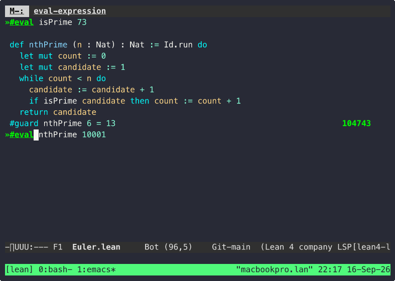

#+TITLE: Lean 4 Workshop
#+AUTHOR: aygp-dr
#+OPTIONS: toc:2 num:nil

[[https://github.com/aygp-dr/lean4-workshop/actions/workflows/ci.yml][https://github.com/aygp-dr/lean4-workshop/actions/workflows/ci.yml/badge.svg]] [[https://github.com/leanprover/lean4][https://img.shields.io/badge/Lean-4.23.0-blue.svg]] [[https://github.com/aygp-dr/lean4-workshop/blob/main/LICENSE][https://img.shields.io/badge/license-MIT-green.svg]] [[https://github.com/aygp-dr/lean4-workshop][https://img.shields.io/github/stars/aygp-dr/lean4-workshop.svg]] [[https://orgmode.org][https://img.shields.io/badge/docs-org--mode-blueviolet.svg]]

* Overview

A workshop for using [[https://lean-lang.org][Lean 4]] as a programming language first. It is a
strict, pure, functional language with dependent types that compiles through
C, and it has an unusually tight feedback loop: ~#eval~ runs an expression,
~#check~ prints its type, and ~#guard~ turns an example into a compile-time
test. Every ~sorry~ is a typed hole the compiler keeps pointing at until you
fill it, so the error list is the to-do list.

The proofs are still here, in the same files and the same syntax, for when a
~#guard~ over three examples stops being enough and you want the claim for
every input. Nothing in the coding path depends on them.

This repository contains:
- Ten warm-up exercises and a scratch area, one small function at a time
- An Emacs profile that gives you the loop above with no setup in your own config
- Runnable examples, functional programming and data structures first, proofs after
- A short language summary that tangles into the exercises and exports to PDF

* Quick Start

** Prerequisites

- Lean 4 (v4.23.0 or later)
- Lake (comes with Lean 4)
- Optional: elan (version manager)

** Check Your Setup

#+BEGIN_SRC sh
gmake deps    # Verify Lean 4 toolchain
gmake check   # Run a quick hello world test
#+END_SRC

* Warm-up Exercises

Ten small files under [[file:exercises/warmup/][exercises/warmup/]], one per chapter of
/Functional Programming in Lean/, in the ~sorry~ + ~#guard~ style Lean99 uses.
Each is self-contained: run one file, replace its ~sorry~ lines until the
output is empty.

#+BEGIN_SRC sh
lean exercises/warmup/W01_Evaluation.lean   # one exercise
gmake warmup                                # all ten; errors are the to-do list
gmake solutions                             # verify the solutions still pass
#+END_SRC

The same exercises with a language summary around them are in
[[file:lean4-programming.org][lean4-programming.org]], which tangles to a single
~exercises/Warmup.lean~ (~gmake tangle~) and exports to PDF (~gmake pdf~).

* Editor Setup

** VS Code (Recommended)

Install the =lean4= extension from the marketplace.

** Emacs

Navigating [[file:scratch/Euler.lean][scratch/Euler.lean]]; see [[file:docs/demo/README.org][docs/demo/]] for how it was
recorded and how to make a fresh one.

The repo ships its own isolated Emacs profile so your ~/.emacs.d is never
read or written:

#+BEGIN_SRC sh
bin/l4w-emacs                                   # exercise picker
bin/l4w-emacs exercises/warmup/W02_Recursion.lean
#+END_SRC

First launch installs lsp-mode, lsp-ui, company, flycheck and lean4-mode
under ~.emacs.d/elpa~ (gitignored, 15 MB); later launches start in about
two seconds. You get Lean font lock with LSP semantic highlighting,
inline diagnostics, completion, and the workshop commands below. The
profile is [[file:.emacs.d/init.el][.emacs.d/init.el]]; the commands are
[[file:lean4-workshop.el][lean4-workshop.el]], which also loads into a
normal Emacs with ~(load-file ...)~ then ~M-x l4w/setup~.

Everything is under ~C-c l~; ~C-c l ?~ lists it.

| Key       | Command                 | What it does                                          |
|-----------+-------------------------+-------------------------------------------------------|
| ~C-c l e~ | ~l4w/exercise~          | pick an exercise file                                  |
| ~C-c l c~ | ~l4w/check~             | run ~lean~ on the file; errors are clickable            |
| ~C-c l n~ | ~l4w/next-sorry~        | jump to the next ~sorry~ (~p~ for previous)             |
| ~C-c l t~ | ~l4w/todo~              | occur over every ~sorry~                                |
| ~C-c l N~ | ~l4w/scratch~           | new ~scratch/<name>.lean~ with a ~main~ (gitignored)     |
| ~C-c l r~ | ~l4w/run~               | ~lean --run~ the file's ~main~ (~<~ to pipe a file in)   |
| ~C-c l a~ | ~l4w/check-all~         | check every exercise; prefix arg for solutions          |
| ~C-c l v~ | ~l4w/eval~              | ~#eval~ an expression with the buffer's definitions in scope |
| ~C-c l k~ | ~l4w/check-expr~        | ~#check~ likewise; ~#~ for ~#print~                       |
| ~C-c l o~ | ~l4w/set-option~        | insert a ~set_option … in~ debug prefix (traces, ~pp.all~) |
| ~C-c l s~ | ~l4w/solution~          | toggle exercise and its solution, only when you ask     |
| ~C-c l x~ | ~l4w/select-toolchain~  | run every command against another installed toolchain   |
| ~C-c l m~ | ~l4w/make~              | run a Makefile target                                   |
| ~C-c l g~ | ~l4w/tangle-and-check~  | tangle the org document and check the result            |
| ~C-c l P~ | ~l4w/export-pdf~        | export the org document to PDF                          |

The mode line shows the number of ~sorry~ left. ~l4w/eval~ and
~l4w/check-expr~ are the debugger when LSP is not enough: they append the
command to a copy of the buffer and run ~lean~, so the expression sees every
definition, ~sorry~ included. Solutions never open on their own.

~bin/l4w-emacs~ needs nothing from your own config; its profile installs
lean4-mode with ~package-vc-install~. To use lean4-mode in your own Emacs
instead, this recipe was run verbatim against a fresh straight.el bootstrap
and pulls lsp-mode, dash, magit-section and compat with it:

#+BEGIN_SRC elisp
;; Using straight.el + use-package
(use-package lean4-mode
  :straight (lean4-mode
             :type git
             :host github
             :repo "leanprover-community/lean4-mode"
             :files ("*.el" "data")))
;; or, with package-vc (Emacs 29+):
;; M-x l4w/install-lean4-mode
#+END_SRC

Key binding: =C-c C-i= toggles the proof state view.

* Learning Path

** 1. Write Programs (Start Here)

| Step | Where | What you get |
|------+-------+--------------|
| Warm-up | [[file:exercises/warmup/][exercises/warmup/]] | ~def~ syntax, pattern matching, structures, type classes, ~Id.run do~, ~IO~ |
| List functions | [[file:scratch/Lists.lean][scratch/Lists.lean]] | ~len~, ~append~, ~reverse~, ~member~, ~map~, ~filter~, ~foldr~, the SICP day-one set, with a guard each |
| FP examples | [[file:examples/fp/][examples/fp/]] | Option, IO, State, type classes, recursion patterns |
| Data | [[file:examples/data/][examples/data/]] | structures, arrays, inductive types |
| The book | [[https://lean-lang.org/functional_programming_in_lean/][Functional Programming in Lean]] | the exercises follow its chapter order |

Reset any solved file to its stubs with ~git show <commit>:path > path~; the
warm-up README lists the commits.

** 2. Then Prove Things

| Resource | Audience | Link |
|----------+----------+------|
| Proof examples | This repo | [[file:examples/proofs/][examples/proofs/]]: logic, equality, induction |
| W10 and Ex01–Ex03 | This repo | first theorems about the functions you wrote |
| Natural Number Game | Everyone | [[https://adam.math.hhu.de/#/g/leanprover-community/NNG4][Play NNG4]] |
| Theorem Proving in Lean 4 | Proof enthusiasts | [[https://lean-lang.org/theorem_proving_in_lean4/][TPIL]] |
| Mathematics in Lean | Mathematicians | [[https://leanprover-community.github.io/mathematics_in_lean/][MIL]] |
| Learn X in Y Minutes | Quick reference | [[https://learnxinyminutes.com/lean4/][Lean4 in Y]] |

See [[file:RESOURCES.org][RESOURCES.org]] for the complete list.

** 3. Satirical Examples: Why Specifications Matter

The =examples/satirical/= directory contains "O(1)" algorithms that satisfy weak specifications but don't actually work:

| Example | The Trick | Lesson |
|---------+-----------+--------|
| O1Sort | Identity function | Permutation spec must check elements |
| O1Search | Return first element | Must verify we found the TARGET |
| O1Hash | Return length | Determinism alone is useless |
| O1Compress | Return empty list | Must require decompression |
| O1Encrypt | Identity function | Reversibility without confidentiality |

#+BEGIN_SRC lean4
-- From examples/satirical/01_O1Sort.lean
def sort {α : Type} : List α → List α := id

-- WARNING: This is INTENTIONALLY WRONG!
def isPermutation : List α → List α → Bool
  | xs, ys => xs.length == ys.length  -- Only checks length!
#+END_SRC

The =examples/correct/= directory shows how specifications /should/ be written.

*Moral*: Formal verification proves your code matches your spec. It doesn't prove your spec is what you actually wanted.

* Reference

** Repository Structure

The full listing is on GitHub; here's what each part is for.

- [[file:exercises/][exercises/]] — the workshop proper: numbered exercises with a
  =Solutions/= directory, plus [[file:exercises/warmup/][warmup/]], ten smaller files in the same
  =sorry= + =#guard= style.
- [[file:examples/][examples/]] — runnable reference code: functional programming, data
  structures, proofs, and a =satirical/= set on why specifications matter.
- [[file:scratch/][scratch/]] — tracked, evolving work in progress; not exercises, just
  code as it's being built.
- [[file:docs/][docs/]] — notes and recordings, including [[file:docs/demo/][docs/demo/]].
- [[file:lean4-workshop.el][lean4-workshop.el]] and [[file:bin/l4w-emacs][bin/l4w-emacs]] — the Emacs support described above.
- [[file:lean4-programming.org][lean4-programming.org]] — language summary that tangles to
  =exercises/Warmup.lean=.
- [[file:Makefile][Makefile]], [[file:lean-toolchain][lean-toolchain]], [[file:.github/workflows/][.github/workflows/]] — build, version pin, and CI.

** Verified Versions

What the repo was last checked against, on macOS arm64 (2026-09-15):

| Component     | Version                          | Note                                                   |
|---------------+----------------------------------+--------------------------------------------------------|
| Lean          | 4.23.0 (pinned in lean-toolchain)| examples, exercises and solutions all pass              |
| Lean          | 4.32.0                           | solutions also pass; ~Array.mkArray~ and ~String.split~ changed, solutions avoid both |
| elan          | 4.1.2                            |                                                        |
| GNU Emacs     | 32.0.50                          | profile needs 29+ for ~--init-directory~ and ~package-vc~ |
| lean4-mode    | 1.1.2 (commit 1388f9d)           | from leanprover-community, not on MELPA                  |
| lsp-mode      | 20260905                         | with lsp-ui, company, flycheck, magit-section from MELPA |
| GNU make      | ~gmake~                          | ~/usr/local/bin/bash~ on FreeBSD, ~/bin/bash~ elsewhere |
| pdflatex      | TeX Live 2024                    | for ~gmake pdf~: tcolorbox, titlesec, listingsutf8        |

~gmake verify~ runs everything Lean-side; ~gmake emacs~ byte-compiles the Emacs support.

** Makefile Targets

| Target | Description |
|--------+-------------|
| =help= | Show available targets |
| =deps= | Check Lean 4 toolchain |
| =check= | Verify installation with hello world |
| =build= | Build project with Lake |
| =clean= | Remove build artifacts |
| =verify= | Verify all Lean files: examples, exercises, solutions, scratch |
| =verify-examples= | Check satirical, correct, fp, proofs and data examples |
| =verify-exercises= | Check exercises parse and solutions pass |
| =warmup= | Check the ten warm-up exercises; errors are the to-do list |
| =solutions= | Verify every solution compiles with no errors |
| =scratch= | Verify tracked scratch files compile |
| =tangle= | Tangle lean4-programming.org to exercises/Warmup.lean |
| =pdf= | Export lean4-programming.org to PDF |
| =emacs= | Byte-compile lean4-workshop.el as a lint pass |
| =edit= | Open the isolated Emacs profile |

* Contributing

1. Fork the repository
2. Create a feature branch
3. Make your changes (org-mode files only)
4. Submit a pull request

* Community

- [[https://leanprover.zulipchat.com/][Zulip Chat]] - Active, welcoming community
- [[https://github.com/leanprover/lean4][Lean 4 GitHub]] - Source and issues
- [[https://github.com/leanprover-community/mathlib4][Mathlib4]] - Mathematics library

* License

MIT License - See LICENSE file for details.

* Acknowledgments

- [[https://leanprover.github.io/][Lean Prover Community]]
- [[https://www.microsoft.com/en-us/research/project/lean/][Microsoft Research]]
- Workshop participants and contributors
