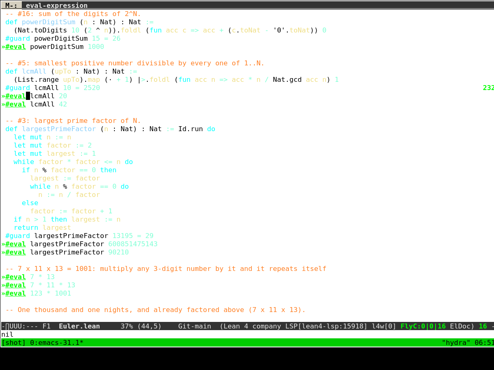

#+TITLE: Demo recordings
#+OPTIONS: toc:nil num:nil

* euler-screenshot.png

A static shot of the real terminal session, not a GUI stand-in:
=bin/l4w-emacs scratch/Euler.lean= run inside ~xterm~ on a virtual
~Xvfb~ display on a headless remote host (no physical display, no
macOS-style screen-recording permission needed), captured with ~xwd~.
The buffer is scrolled to a specific ~#eval~ line rather than shown at
its default top-of-file view -- driven there with =tmux send-keys= over
a separate ssh connection while ~xterm~ handled the rendering, so the
shot could be taken at a chosen moment instead of whenever the command
happened to settle. Mode line reads =LSP[lean4-lsp:PORT] FlyC:0|0|16=
with a real initialization message -- a fully connected LSP session,
on FreeBSD,
via the Linux-compat toolchain in [[file:lean-on-freebsd.org][lean-on-freebsd.org]] (needs
=$HOME/.elan-linux/bin= on ~PATH~ before launching). Full pipeline is in
[[https://github.com/jwalsh/emacs-recording-tools][jwalsh/emacs-recording-tools]] (=bin/xvfb-terminal-shot.sh=).

* euler-evals.gif

Navigating [[file:../../scratch/Euler.lean][scratch/Euler.lean]] top to bottom, landing on each ~#eval~
line in turn. No typing, no editing — just what the file looks like once
every problem has a body and an example. Recorded with [[https://asciinema.org][asciinema]]
attached directly to the running tmux window (not a screen capture),
converted to GIF with [[https://github.com/asciinema/agg][agg]].

** Prerequisites

- ~asciinema~ and ~agg~ (~brew install asciinema agg~)
- ~tmux~
- A tmux session with =bin/l4w-emacs scratch/Euler.lean= already running
  in a window — this walkthrough assumes it's named ~lean:emacs~; adjust
  to whatever session/window name you actually used.

** Reproduce

#+begin_src sh
# 1. Record. This attaches a *second* client to the existing window and
#    records everything shown there; it does not touch the window itself.
asciinema rec euler-evals.cast \
  -c "tmux attach -t lean:emacs" \
  --title "Euler.lean: navigating the eval blocks"
#+end_src

While that's running, from another shell, walk the buffer down through
every ~#eval~ line (16, at the time this was recorded):

#+begin_src sh
tmux send-keys -t lean:emacs Escape ":" '(goto-char (point-min))' Enter
for i in $(seq 1 16); do
  tmux send-keys -t lean:emacs Escape ":" '(re-search-forward "^#eval" nil t)' Enter
  sleep 0.9
done
#+end_src

Then stop the recording by detaching *only* the client asciinema opened,
not your own terminal — list clients and detach the one asciinema
spawned (it'll be the extra one, usually at a default 80x24 size):

#+begin_src sh
tmux list-clients -t lean
tmux detach-client -t /dev/ttysNNN   # the asciinema one, not yours
#+end_src

#+begin_src sh
# 2. Convert to GIF.
agg --speed 1.5 --font-size 16 euler-evals.cast euler-evals.gif
#+end_src

** Notes

- ~scratch/Euler.lean~ is tracked and evolves; a fresh recording will
  show whatever's in it *now*, not necessarily 16 evals ending on
  ~nthPrime 10001~. That's expected — this is a recording of the file
  as it stood at commit [[https://github.com/jwalsh/lean4-workshop/commit/52e5230][52e5230]], not a fixture.
- ~--speed 1.5~ and ~--font-size 16~ are taste; ~agg --help~ lists the
  rest (theme, cols/rows, idle-time capping for long pauses).
